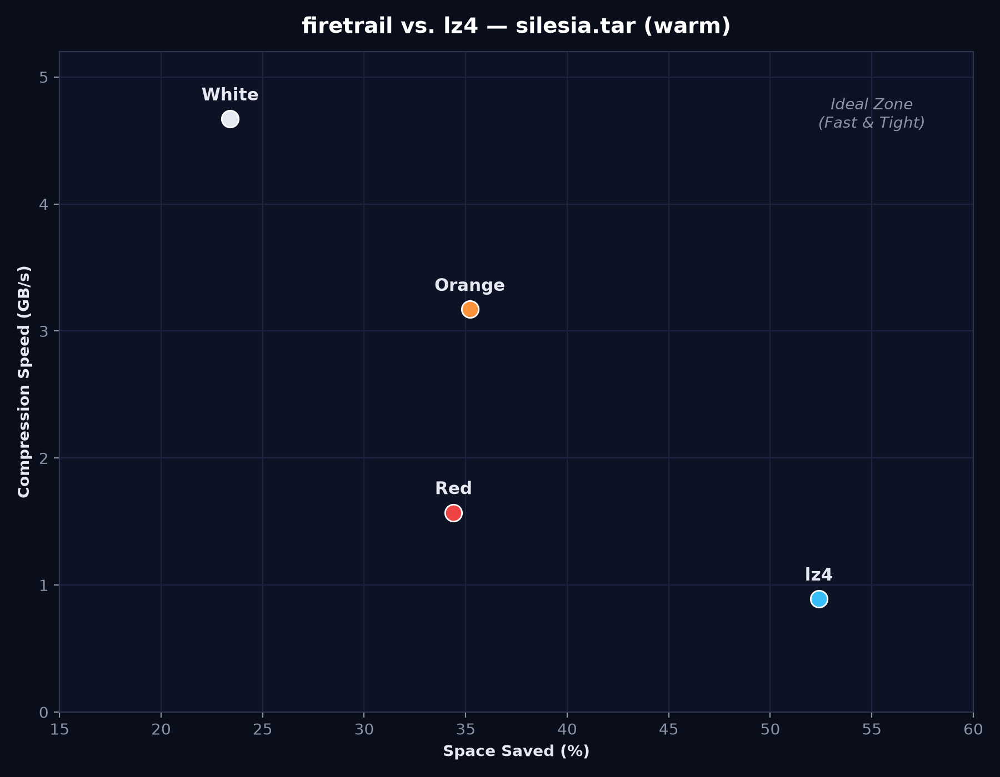

# firetrail

A density inspired set of compressors going at blazing speeds.

## TLDR

All benchmarks are done on my pc (Ryzen 7 7800X3D). Take them with a grain of salt.

Firetrail comes in three flavors, all built around the same idea: hash 8-byte words into a 512 KB lookup table, emit a 2-byte hash on a match, the raw word otherwise.

- **White** never updates its table. It's a static-dictionary codec: train a dictionary once (`--export`), deploy it everywhere (`--import`). Fastest of the three.
- **Orange** updates its table on every miss (last-write-wins). Adapts to any data, no dictionary needed.
- **Red** updates its table only when a slot's frequency count decays to zero. Slower, but the best dictionary trainer.

## [HDFS.log](https://www.kaggle.com/datasets/ayenuryrr/loghub-hdfs-hadoop-distributed-file-system-data)

1,577,982,906 bytes, single-thread, in-memory

| Codec                | Config                  | Encode (GB/s) | Decode (GB/s) |     Ratio |
| -------------------- | ----------------------- | ------------: | ------------: | --------: |
| **firetrail White**  | warm (red-trained dict) |          6.57 |      **9.64** |     2.19× |
| **firetrail Orange** | cold                    |          4.95 |          7.99 |         — |
| **firetrail Orange** | warm                    |          4.95 |          7.96 | **2.53×** |
| **firetrail Red**    | cold                    |          2.66 |          3.43 |         — |
| **firetrail Red**    | warm                    |          2.66 |          3.45 |     2.43× |
| density Chameleon    | raw                     |          4.07 |          4.18 |     1.86× |
| density Cheetah      | raw                     |          1.60 |          1.36 |     4.97× |
| density Lion         | raw                     |          1.03 |          1.17 |     5.61× |
| LZ4                  | default                 |          1.43 |          5.05 |     5.69× |
| Snappy               | stream                  |          1.41 |          2.29 |     5.50× |

## Benchmark plot



## Usage

### CLI Tool

```bash
firetrail {white|orange|red} [encode | decode] <input> <output> [--import <lut_file>] [--export <lut_file>]
```

The argument `<input>` or `<output>` can be replaced with `-` to stream from `stdin` or to `stdout` respectively.

`--import` preloads a 512 KB lookup table (dictionary); `--export` writes the table out after encoding. Typical white workflow:

```bash
# Train once (red makes the best dictionaries)
firetrail red --encode sample.log /dev/null --export dict.bin

# Deploy everywhere
firetrail white --encode app.log app.log.ftw --import dict.bin
firetrail white --decode app.log.ftw app.log --import dict.bin
```

### Benchmarks

```bash
zig build bench --release=fast -- data/silesia.tar
```

Cold runs use an empty table; warm runs use a dictionary trained by red on the input itself.
